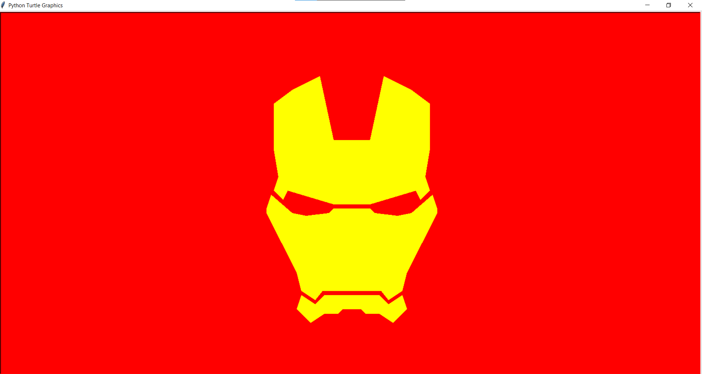

# 🦾 Iron Man Face with Python Turtle

This project uses Python's `turtle` graphics library to draw a stylized **Iron Man** face step by step. It's designed as a fun and educational exercise for Python beginners interested in graphics programming.

---

## 🚀 Features

- 🎨 Stylized Iron Man face made with Turtle graphics  
- 🧱 Constructed using basic shapes and coordinates  
- 🛠️ Customizable colors and screen dimensions  
- 👶 Beginner-friendly and easy to follow

---

## 🧰 Requirements

- Python 3.x  
- `turtle` module *(included by default with standard Python distributions)*

---

## ▶️ How to Run

1. Clone or download this repository.
2. Open a terminal in the project folder.
3. Run the script with:

   ```bash
   python main.py
   ```

A new window will open showing the Iron Man face drawn step by step.

---

## 📁 Files Included

- `main.py` – Main script for drawing the Iron Man face using turtle graphics

---

## 🖼️ Screenshot

 
> Tip: Use the `turtle.getcanvas().postscript()` method if you want to export the drawing.

---

## 📜 License

This project is open-source and intended for **educational purposes only**.  
Feel free to modify or share with attribution.
